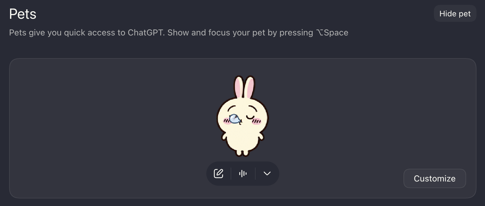
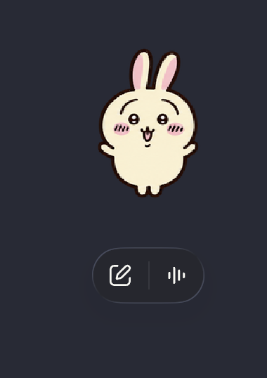

# Usagi Codex Pet Prompts

This repository documents the text prompts and reference links used in a private, unofficial Codex desktop-pet project inspired by Usagi from *Chiikawa*.

## Showcase

These screenshots show the private pet running inside the Codex desktop app. They demonstrate the result of the prompt workflow; they are not downloadable pet assets.





The displayed character art is unofficial, unlicensed, non-commercial fan work. Usagi and *Chiikawa* remain the property of their respective rights holders. The Codex and ChatGPT interface and marks belong to OpenAI. No affiliation or endorsement is implied.

## What is public

- `prompts/` contains the generation prompts, repair prompts, and directional-look instructions.
- `references.md` records the external pages used as visual references. The reference images themselves are not copied here.
- `showcase/` contains two selected in-app screenshots.
- `NOTICE.md` explains the personal-use and rights status.
- `PUBLICATION.md` records the boundary between the public showcase and private build files.

## What is deliberately private

This repository does **not** contain third-party reference images, generated source images, animation frames, spritesheets, Codex pet packages, QA contact sheets, or installable downloads. Those files remain on the repository owner's machine and are excluded by `.gitignore`.

The prompts and screenshots are shared as process documentation and showcase material. They do not grant permission to use Usagi, *Chiikawa*, any linked reference image, the displayed derivative artwork, or OpenAI's interface and marks. A link is attribution and context; it is not a license. This project is unofficial, unlicensed, personal, and non-commercial.

## Prompt layout

```text
prompts/
  base-pet.md              Main character prompt
  rows/                    Initial animation prompts
  row-retries/             Later corrections and refinements
  look-cardinals.md        Cardinal-direction prompt
  look-anchor-repairs/     Direction-specific repair prompts
  look-mechanics.md        Directional movement rules
```

The private working copy uses the [Hatch Pet Codex skill](https://github.com/openai/codex) to turn these prompts into an 8 × 11 Codex v2 atlas. Anyone adapting the prompts should use an original character or artwork they are authorized to reproduce and distribute.

## Reference status

The supplied discovery links are recorded in [references.md](references.md), along with the visible page/account attribution and current permission status. Several are platform reposts, social posts, or marketplace listings rather than verified rights-holder sources. Original publication links and explicit reuse terms should be added when they can be identified.

No license file is included because the repository owner is not granting rights to the underlying character, linked artwork, displayed derivative artwork, or third-party interface elements.
